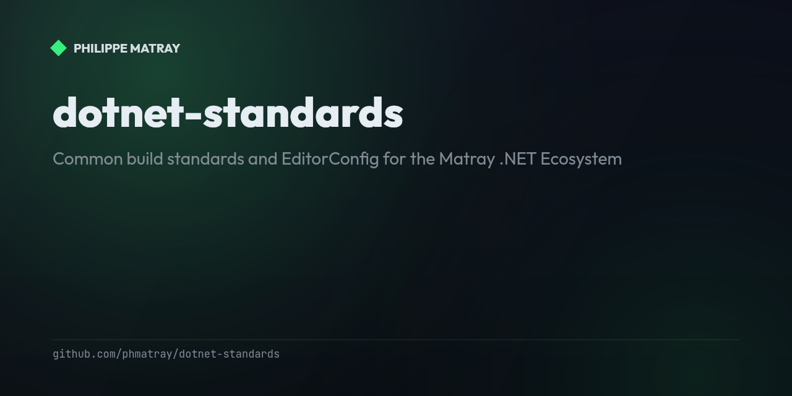

# .NET Standards — Matray Ecosystem

<!-- portfolio-badges:start -->
<!-- Identity -->
[](https://github.com/phmatray/dotnet-standards)

[](https://github.com/phmatray/dotnet-standards/stargazers)
[](https://github.com/phmatray/dotnet-standards/network/members)
[](https://github.com/phmatray/dotnet-standards/blob/HEAD/LICENSE)

<!-- Activity -->
[](https://github.com/phmatray/dotnet-standards/issues)
[](https://github.com/phmatray/dotnet-standards/pulls)
[](https://github.com/phmatray/dotnet-standards/commits)
<!-- portfolio-badges:end -->

<!-- portfolio-toc:start -->

## Table of Contents

- [🎯 Purpose](#-purpose)
- [📦 Distribution](#-distribution)
- [🚀 Quick Start](#-quick-start)
- [📋 What's Included](#-whats-included)
- [🔧 Standards Overview](#-standards-overview)
- [📚 Adoption Guide](#-adoption-guide)
- [🎨 Customization Per Repo](#-customization-per-repo)
- [🧪 Testing Standards in Isolation](#-testing-standards-in-isolation)
- [📊 Rollout Phases](#-rollout-phases)
- [🛠️ Troubleshooting](#-troubleshooting)
- [📖 References](#-references)
- [Tech Stack](#tech-stack)
- [🤝 Contributing](#-contributing)
- [📄 License](#-license)

<!-- portfolio-toc:end -->

<!-- portfolio-features:start -->

## Features

- **One set of build standards** — centralized MSBuild props/targets shared across every .NET project in the ecosystem
- **Consistent style** — a single `.editorconfig` and StyleCop config enforced everywhere
- **Analyzers on by default** — modern C#/.NET analyzers wired in for all consumers
- **Reproducible builds** — deterministic builds + Source Link out of the box
- **Automatic versioning** — MinVer-based versioning from git tags
- **Fast adoption** — new solutions pick up the standards in minutes via the shared imports

<!-- portfolio-features:end -->


**Common build standards and EditorConfig for the Matray .NET Ecosystem**

This repository provides centralized build standards, coding conventions, and configurations for all .NET projects in the Matray ecosystem (250+ repositories).

## 🎯 Purpose

- **Consistency** — One .editorconfig, one set of build properties for all projects
- **Quality** — Enforce modern C# 14 / .NET 10 best practices
- **Automation** — MinVer versioning, Source Link, deterministic builds
- **Speed** — New projects adopt standards in minutes, not hours

## 📦 Distribution

### NuGet Package: `Atypical.Build.Standards`

The standards are distributed as a NuGet package for easy consumption.

**Install:**
```bash
dotnet add package Atypical.Build.Standards
```

### Manual Adoption (Alternative)

Copy the files directly to your repository root:
- `.editorconfig`
- `Directory.Build.props`
- `Directory.Build.targets`
- `global.json` (optional)

## 🚀 Quick Start

### 1. Install the NuGet Package

```bash
dotnet add package Atypical.Build.Standards --version 1.0.0
```

### 2. Verify Build

```bash
dotnet build
```

The standards are automatically applied to all projects in your solution.

### 3. Customize (Optional)

You can override specific settings in your project's `.csproj` or create a local `Directory.Build.props` that imports the shared one:

```xml
<Project>
  <Import Project="path/to/shared/Directory.Build.props" />
  
  <!-- Your custom overrides -->
  <PropertyGroup>
    <TargetFramework>net9.0</TargetFramework>
  </PropertyGroup>
</Project>
```

## 📋 What's Included

### `.editorconfig`
- **C# 14 / .NET 10** modern code style rules
- **Roslynator** analyzer integration
- **File-scoped namespaces** enforced
- **Nullable reference types** enabled
- **Strict naming conventions** (interfaces start with `I`, etc.)
- **Code formatting** rules (spacing, indentation, line breaks)

### `Directory.Build.props`
- **Language settings:** C# 14, .NET 10, nullable enabled, implicit usings
- **Code quality:** .NET analyzers, code style enforcement
- **Deterministic builds:** CI detection (GitHub Actions, Azure DevOps)
- **Package metadata:** Author, company, license, repository URL
- **Source Link:** Embed source files for better debugging
- **MinVer:** Automatic versioning from Git tags

### `Directory.Build.targets`
- **MinVer version display:** Show version during build

### `global.json`
- **SDK version pinning:** .NET 10.0.103 with latest patch rollforward

## 🔧 Standards Overview

### Language & Framework
- Target Framework: **.NET 10.0**
- Language Version: **C# 14**
- Nullable: **Enabled**
- Implicit Usings: **Enabled**

### Code Quality
- .NET Analyzers: **Enabled**
- Analysis Level: **Latest**
- Code Style Enforcement: **Enabled in build**
- Warnings as Errors: **Disabled** (opt-in per project)

### Versioning (MinVer)
- Git tag prefix: `v` (e.g., `v1.2.3`)
- Automatic versioning from Git history
- Skipped in Debug mode

### Package Metadata
- Author: **Philippe Matray**
- Company: **Atypical Consulting SRL**
- License: **MIT**
- Repository: Auto-detected from project name
- Tags: `dotnet`, `csharp`, `matray-ecosystem`

## 📚 Adoption Guide

### For New Projects

1. Create your project:
   ```bash
   dotnet new classlib -n MyAwesomeLibrary
   cd MyAwesomeLibrary
   ```

2. Install standards:
   ```bash
   dotnet add package Atypical.Build.Standards
   ```

3. Build and verify:
   ```bash
   dotnet build
   ```

4. Initialize Git and create first tag:
   ```bash
   git init
   git add .
   git commit -m "Initial commit with Atypical.Build.Standards"
   git tag v0.1.0
   dotnet build
   ```

### For Existing Projects

1. **Backup first!** Create a branch:
   ```bash
   git checkout -b adopt-standards
   ```

2. Install standards:
   ```bash
   dotnet add package Atypical.Build.Standards
   ```

3. Remove conflicting settings from `.csproj`:
   - Remove `<TargetFramework>` (unless you need a different version)
   - Remove `<LangVersion>`, `<Nullable>`, `<ImplicitUsings>` (now in shared props)
   - Remove `<Authors>`, `<Company>`, `<Copyright>` (now in shared props)

4. Build and fix any warnings:
   ```bash
   dotnet build
   ```

5. Run tests:
   ```bash
   dotnet test
   ```

6. Review changes and merge:
   ```bash
   git add .
   git commit -m "Adopt Atypical.Build.Standards"
   git checkout main
   git merge adopt-standards
   ```

## 🎨 Customization Per Repo

You can override any setting by creating a local `Directory.Build.props` in your repo root:

```xml
<Project>
  <!-- Import shared standards -->
  <Import Project="$(MSBuildThisFileDirectory)node_modules/Atypical.Build.Standards/Directory.Build.props" />
  
  <!-- Your custom overrides -->
  <PropertyGroup>
    <TargetFramework>net9.0</TargetFramework>
    <PackageTags>$(PackageTags);my-special-tag</PackageTags>
  </PropertyGroup>
</Project>
```

Or directly in your `.csproj`:

```xml
<Project Sdk="Microsoft.NET.Sdk">
  <PropertyGroup>
    <!-- Override framework for this project only -->
    <TargetFramework>net8.0</TargetFramework>
  </PropertyGroup>
</Project>
```

## 🧪 Testing Standards in Isolation

To test the standards without affecting existing projects:

1. Create a test directory:
   ```bash
   mkdir test-standards && cd test-standards
   ```

2. Copy standards files:
   ```bash
   cp /path/to/dotnet-standards/.editorconfig .
   cp /path/to/dotnet-standards/Directory.Build.props .
   cp /path/to/dotnet-standards/Directory.Build.targets .
   cp /path/to/dotnet-standards/global.json .
   ```

3. Create a simple test project:
   ```bash
   dotnet new classlib -n TestLib
   dotnet build TestLib
   ```

4. Verify that standards are applied (check build output for MinVer version).

## 📊 Rollout Phases

### Phase 1: Pilot (Tier 1 Repos)
- **VatBe** (production web app)
- **Mutty** (validation library)
- **FormCraft** (form builder)

### Phase 2: Tier 1 Expansion
- Top 10 revenue-generating / production-ready repos

### Phase 3: Mass Rollout
- 80% of active repos (commit within last 6 months)

### Phase 4: Archive Handling
- Skip archived/dormant repos (fix on-demand if needed)

## 🛠️ Troubleshooting

### "MinVer version not showing"
- Ensure you have at least one Git tag (e.g., `git tag v0.1.0`)
- MinVer is skipped in Debug mode and when `$(Version)` is already set

### "Build warnings increased"
- This is expected! The standards enforce stricter rules
- Review and fix warnings progressively
- Use `<NoWarn>` for specific diagnostics if needed

### "Conflicts with existing Directory.Build.props"
- Your existing file takes precedence
- Merge settings manually or rename your file and import the shared one

### ".editorconfig not applied in IDE"
- Restart your IDE (Visual Studio, Rider, VS Code)
- Ensure `.editorconfig` is in the repository root
- Check that `root = true` is set

## 📖 References

- [EditorConfig Documentation](https://editorconfig.org)
- [.NET Code Style Rules](https://learn.microsoft.com/en-us/dotnet/fundamentals/code-analysis/style-rules/)
- [MinVer Versioning](https://github.com/adamralph/minver)
- [Source Link](https://github.com/dotnet/sourcelink)
- [MSBuild Common Properties](https://learn.microsoft.com/en-us/visualstudio/msbuild/common-msbuild-project-properties)

<!-- portfolio-techstack:start -->

## Tech Stack

- **.NET 8**

<!-- portfolio-techstack:end -->

<!-- portfolio-roadmap:start -->

## Roadmap

Planned work and known limitations are tracked in the [open issues](https://github.com/phmatray/dotnet-standards/issues). Contributions toward them are welcome.

<!-- portfolio-roadmap:end -->

## 🤝 Contributing

Standards evolve! If you find improvements or issues:

1. Open an issue in this repository
2. Propose changes via pull request
3. Discuss in #dotnet-standards Slack channel (if available)

## 📄 License

MIT License — See [LICENSE](LICENSE) for details.

---

**Matray .NET Ecosystem** — 250+ repos, 1 standard ✨

<!-- portfolio-nugetkeep:start -->
---
Built by [Atypical Consulting](https://www.atypical.consulting). We also make
[NuGetKeep](https://nugetkeep.com/?utm_source=github-readme&utm_medium=readme&utm_campaign=launch-2026-07),
a self-hosted NuGet server with supply-chain quarantine.
<!-- portfolio-nugetkeep:end -->
